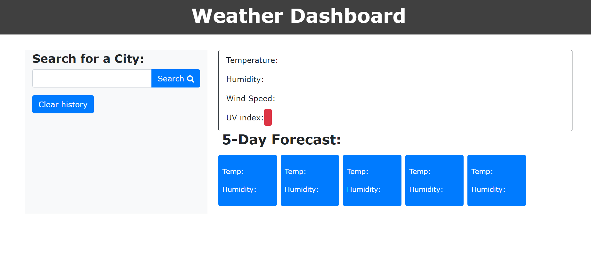

# WEATHER-DASHBOARD

## Overview

- Weather Dashboard is an application to find weather conditions for a given city.
- It displays current weather and also a 5-day weather forecast.
- The cities searched are added as a list and get saved and appear on reaload.
- The clear history button clears the search.

## Description

- The server-side API used to get response data object is from the Open Weather API.

- The current weather section displays the following information :

* City, Date, Icon-image
* Temprature
* Wind Speed
* Humidity
* UV Index

- The 5-days weather forecast is displayed below the current weather conditions section and it includes the following information for each day:

* Date
* Icon image
* Temperature
* Humidity

- The local storage is used to store the previous city search and display them underneath the search and clear history button in a list.
- The clear history button clears all the search data.
- The previously searched cities appear on reload of the page if the history has not been cleared.
- If the user wants to see the past city weather conditions again,they can click on the city-name from the list.

## Assets:

- The following are the screenshots of the application
  
  
  
  
- The following is the link to the deployed code : https://github.com/SrilalithaN/Weather-Dashboard
- The following is the link to the deployed application:

## Credits:

- I have used resources from google, youtube tutorials and knowledge from class-activities by my instructors for this applciation.
